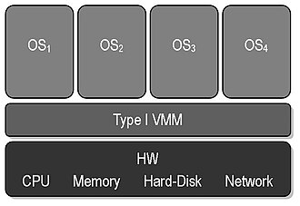
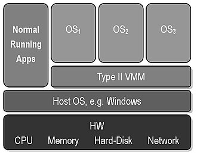

# Thema: Hypervisor

## Inhaltsverzeichnis

1. [Was ist ein Hypervisor?](#was-ist-ein-hypervisor)
2. [Wie funktioniert ein Hypervisor?](#wie-funktioniert-ein-hypervisor)
3. [Welche Arten von Hypervisoren gibt es?](#welche-arten-von-hypervisoren-gibt-es)
4. [Welche Hypervisor-Software gibt es?](#welche-arten-von-hypervisoren-gibt-es)
5. [Quellen](#quellen)

## Was ist ein Hypervisor?

Ein Hypervisor, auch bekannt als Virtual-Machine-Monitor oder VMM, ist eine Software, mit der die Ressourcen einer physischen Maschine zusammengefasst und verteilt werden können.  
Das Zusammenfassen und Verteilen von Ressourcen ermöglicht das Virtualisieren, wodurch **virtuelle Maschinen (VMs)** erstellt und verwendet werden können.  

Der Name Virtual-Machine-Monitor leitet sich daraus ab, dass der Hypervisor die Verteilung der Ressourcen "überwacht" - also auf Englisch **Monitoring** betreibt.  
Auch der Name Hypervisor leitet sich von einem ähnlichen Wortstamm ab. Der Begriff "Hyper" kommt aus dem Griechischen und bedeutet "über", während Visor vom lateinischen "videre" kommt, was "sehen" bedeutet.  
Zusammengesetzt ergibt sich daraus wieder etwas wie ein Aufseher.  

Die physische Maschine, auf welcher der Hypervisor läuft, ist der Host - die virtuellen Maschinen werden Guests genannt.

## Wie funktioniert ein Hypervisor?

Ein Hypervisor verwaltet lediglich den Zugriff auf die Hardwareressourcen. Angeforderte Rechenleistung und Aufgaben werden dabei an die Host-Hardware weitergeleitet und je nach Verfügbarkeit ausgeführt.  
Während auf einem Hostsystem ohne Virtualisierung nur ein Betriebssystem zur selben Zeit laufen kann, kann durch Virtualisierung die vorhandene Hardware auf mehrere Maschinen aufgeteilt werden.  
Dies ermöglicht den gleichzeitigen Betrieb **mehrerer** Betriebssysteme auf **einer** physischen Maschine.

## Welche Arten von Hypervisoren gibt es?

Hypervisoren werden zwischen Typ-1 und Typ-2 unterschieden. Während beide Typen die Hardwareressourcen auf virtuelle Maschinen aufteilen, unterscheiden sie sich in ihrer Funktionsweise.

### Typ-1-Hypervisor

Hypervisoren von Typ-1 werden auch **native** oder **bare-metal** genannt, da sie direkt auf der Host-Hardware laufen.

Dieses Bild stellt die Funktionsweise eines Typ-1-Hypervisors dar. Die Hypervisor-Software liegt direkt auf der Host-Hardware und darauf laufen Gast VMs.  
Ein Typ-1-Hypervisor ersetzt das Hostbetriebssystem und verwaltet die Ressourcen der Host-Hardware direkt.  

Der Vorteil von Typ-1-Hypervisoren ist, dass auf der Hardware kein Betriebssystem installiert werden muss, sondern dass der Hypervisor direkt darauf läuft.  
Der Nachteil ist jedoch, dass die Hardware des Hostsystems vom Hypervisor durch passende Treiber unterstützt werden muss.  

Typ-1-Hypervisoren finden großteils in der Unternehmenswelt Anwendung, wo VMs direkt auf Servern laufen und verwaltet werden.  

### Typ-2-Hypervisor

Hypervisoren vom Typ-2 werden auch **hosted** genannt, da sie auf dem Hostbetriebssystem laufen.

Dieses Bild stellt die Funktionsweise eines Typ-2-Hypervisors dar. Die Hypervisor-Software liegt auf dem Hostbetriebssystem, wodurch daneben noch andere Apps betrieben werden können.  

Der Vorteil dieser Virtualisierungsart ist, dass die Hypervisor-Software auf jeder Maschine läuft, auf welcher ein kompatibles Hostbetriebssystem betrieben werden kann. Somit wird der Betrieb auf unteschiedlicher Hardware erleichtert.  
Ein weiterer Vorteil ist die Möglichkeit, neben Gast VMs weitere Anwendungen laufen zu lassen.
Ein Nachteil von Typ-2-Hypervisoren ist die geringere Leistung auf gleicher Hardware aufgrund des Betriebssystems, welches selbst Rechenleistung benötigt.

### Vergleich der 2 Typen

|               |        **Typ-1-Hypervisor**         |           **Typ-2-Hypervisor**           |
|:--------------|:-----------------------------------:|:----------------------------------------:|
| Bekannt als   |          native/bare-metal          |                  hosted                  |
| Läuft auf     |            Host-Hardware            |            Hostbetriebssystem            |
| Geeignet für  |    Große Anwendungen/Unternehmen    |    Kleine Anwendungen/Einzelpersonen     |
| Komplexität   |    Gute Kenntnisse erforderlich     |      Wenige Kenntnisse erforderlich      |
| Beispiele     | Microsoft Hyper-V, KVM, VMware ESXi | Oracle VM Virtualbox, VMware Workstation |

Der Grund für die unterschiedliche Komplexität der beiden Typen ist, dass Typ-1-Hypervisoren aufgrund des fehlenden Hostbetriebssystems meist nur über ein CLI verfügen, während Typ-2-Hypervisoren auf dem Hostbetriebssystem über ein GUI verfügen.

Typ-1-Hypervisoren finden dank der fehlenden Zwischenschicht des Hostsystems eher in der Unternehmenswelt Anwendung:  
Die einzelnen VMs durch das Fehlen eines unterliegenden Betriebssystems mehr voneinander abgeschottet, wodurch die Kompromittierung der individuellen Maschinen durcheinander erschwert wird.  
Des Weiteren steht dem Hypervisor durch das fehlende Betriebssystem die volle Rechenleistung zur Verwaltung zur Verfügung, wodurch Performance und Effizienz gesteigert werden.  

Ebendiese Punkte sind jedoch auch Gründe für die Verwendung von Typ-2-Hypervisoren in kleinen Anwendungsbereichen.
Die Verwendung eines GUIs ist für viele Nutzer einfacher, da dies eher dem Alltag eines durchschnittlichen Nutzers entspricht.
Die Möglichkeit, neben den VMs weitere Anwendungen auf dem Betriebssystem benutzen zu können, erleichtert ebenfalls die Arbeitsvorgänge des durchschnittlichen Nutzers.

## Welche Hypervisor-Software gibt es?

Zu den meistgenutzten Hypervisor-Softwares zählen:

### Microsoft Hyper-V

- Typ-1-Hypervisor
- closed source/Lizenzbasiert
- Besonderheiten:
  - Integration in Windows Server
  - Verwaltung durch Hyper-V Manager (GUI) oder Powershell (CLI)
- Anwendungsfälle:
  - Windows-basierte Servervirtualisierung

### KVM (Kernel-based Virtual Machine)

- Typ-1-Hypervisor
- open source (GPL (GNU General Public License))
- Besonderheiten:
  - Integration in Linux Kernel
  - Verwaltung durch die vorliegende Linux-Installation
- Anwendungsfälle:
  - Linux-basierte Servervirtualisierung

### VMware ESXi

- Typ-1-Hypervisor
- Closed Source/Lizenzbasiert, kostenlose Version verfügbar
- Besonderheiten:
  - Verwaltung über Webinterface möglich
  - tief in vSphere und vCenter integriert (cloud computing Welt von VMware)
- Anwendungsfälle:
  - Unternehmensorientierte Virtualisierung#

### VMware Workstation

- Typ-2-Hypervisor
- Closed Source, kostenfreie nutzung von WMware Workstation Pro
- Besonderheiten:
  - läuft auf Windows und Linux
  - kann in vSphere integriert werden
  - leistungstärker als VirtualBox
- Anwendungsfälle:
  - Softwareentwicklung
  - Lernumgebungen

### Oracle VM VirtualBox

- Typ-2-Hypervisor
- Open Source (GPL), Closed Source Erweiterungen
- Besonderheiten:
  - läuft auf Windows, Linux und macOS
- Anwendungsfälle:
  - Softwareentwicklung
  - Lernumgebungen/Schulen

## Quellen

- [Wikipedia - Hypervisor](https://de.wikipedia.org/wiki/Hypervisor)
- [Wikipedia - Hyper-V](https://en.wikipedia.org/wiki/Hyper-V)
- [Wikipedia - KVM](https://en.wikipedia.org/wiki/Kernel-based_Virtual_Machine)
- [Wikipedia - VMware ESXi](https://en.wikipedia.org/wiki/VMware_ESXi)
- [Wikipedia - VMware Workstation](https://en.wikipedia.org/wiki/VMware_Workstation)
- [Wikipedia - Oracle VM VirtualBox](https://en.wikipedia.org/wiki/VirtualBox)
- [Redhat - What is a Hypervisor](https://www.redhat.com/de/topics/virtualization/what-is-a-hypervisor)
- [AWS - Difference between Type-1 and Type-2](https://aws.amazon.com/de/compare/the-difference-between-type-1-and-type-2-hypervisors/)
- [techtarget - Difference between Type-1 and Type-2](https://www.techtarget.com/searchitoperations/tip/Whats-the-difference-between-Type-1-vs-Type-2-hypervisor)