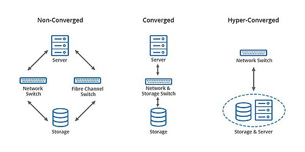

# Thema: Hyperconverged Infrastructure  

## Inhaltsverzeichnis  

1. [Was ist Hyperconverged Infrastructure?](#was-ist-hyperconverged-infrastructure)
2. [Wie funktioniert Hyperconverged Infrastructure?](#wie-funktioniert-hyperconverged-infrastructure)
3. [Vor- und Nachteile von Hyperconverged Infrastructure](#vor--und-nachteile-von-hyperconverged-infrastructure)
4. [Fazit](#fazit)
5. [Welche HCI-Lösungen gibt es?](#welche-hci-lösungen-gibt-es)
6. [Quellen](#quellen)

## Was ist Hyperconverged Infrastructure?

Als hyperconverged Infrastructure (zu Deutsch: hyperkonvergente Infrastruktur) wird IT-Infrastruktur bezeichnet, in welcher **alle** Komponenten eines klassischen Rechenzentrums (Rechenleistung, Speicher, Netzwerk) **zusammengefasst** und **zentral verwaltet** werden.

Hyperconverged Infrastructure ist eine Weiterwentwicklung der Converged Infrastructure, was wiederum eine Weiterentwicklung der traditionellen IT-Infrastruktur ist.

  
*Unterschied zwischen den Verschiedenen Konvergenz-Stufen*  

### Traditionelle Infrastruktur

Im traditionellen Infrastrukturaufbau, welcher seit Jahrzehnten in Rechenzentren gelebt wird, ist jede Komponente des großen Ganzen voneinander getrennt und läuft auf ihrer eigenen Hardware. Dadurch werden **eigene Server** für die Bereitstellung der Rechenleistung benötigt, sowie ein **dediziertes Speichersystem** in Form von SAN oder NAS.  
Dies führt dazu, dass enorme Kosten für den Erwerb der Hardware auftreten, welche im Betrieb durch Kosten für Strom und Stellplatz weiterlaufen. Außerdem ist die Verwaltung traditioneller Infrastruktur aufwändiger, da die einzelnen Komponenten alle alleine angesteuert und konfiguriert werden müssen.

### Converged Infrastructure

Um dem Kostenpunkt und der Inflexibilität der traditionellen Infrastruktur entgegenzuwirken wurde die Architektur der converged infrastructure (zu Deutsch: konvergente Infrastruktur) entwickelt.  
Einzelne Komponenten und Anwendungen der IT-Infrastruktur **teilen** sich nun Ressourcen. Die converged Infrastructure besteht zwar aus einzelnen, physischen Bausteinen - diese werden jedoch als **ganzes System** geplant, als Paket von einem einzelnen Hersteller gekauft und über eine **Management Software** verwaltet.  
Converged Infrastructure als Weiterentwicklung der traditionellen Infrastruktur hat neben dem Kostenpunkt noch den Vorteil, dass durch die gemeinsame Management Software die Verwaltung der ganzen Infrastruktur bedeutend simpler wird. Es muss nicht jede Komponente einzeln angesteuert werden, wodurch auch der Zeitaufwand geringer wird.  
Der Kauf der Infrastruktur als Ganzes von einem einzelnen Hersteller kann sowohl ein Vorteil, als auch ein Nachteil sein - einerseits ist das System in sich bestens abgestimmt, andererseits ist die Flexibilität eingeschränkt, da die Infrastruktur vom Hersteller abhängig ist.

### Hyperconverged Infrastructure

In der Hyperconverged Infrastructure werden die einzelnen Komponenten weiter zusammengefasst, um den Kostenpunkt weiter zu senken und die Flexibilität weiter zu erhöhen.  
Einzelne Komponenten des Gesamtsystems sind nun nicht mehr physisch getrennt, sondern verschwimmen über Hardwaregrenzen hinweg durch **Virtualisierung** ineinander. Die Kapazitäten der verbauten Server (welche meist reguläre commercial off-the-shelf Server sind) werden gepoolt und über einen Hypervisor je nach Bedarf zugeteilt.  

Der Begriff "Hyperconverged" setzt sich aus zwei Wörtern zusammen: hyper, aus dem Griechischen, was so viel wie "über" bedeutet, und converged, beziehungsweise im Deutschen konvergent, was so viel wie "in einem Punkt zusammenkommend" bedeutet. Da die Converged Infrastructure schon teilweise in einem Punkt zusammenkommt und Hyperconverged Infrastructure dies noch weiter treibt, ist sie also "über konvergent".

## Wie funktioniert Hyperconverged Infrastructure?

Durch die Virtualisierung und Abstraktion typischerweise Hardware-basierter Systeme müssen diese anders dargestellt werden, um die Verteilung und gemeinsame Verwaltung zu ermöglichen. Deshalb werden diese Bausteine in **Software** abgebildet:

- **Rechenleistung (Computing)**
    
    Die Rechenleistung in HCI wird durch **Virtualisierung** bereitgestellt. Der Hypervisor ist im Fall der Rechenleistung die Software, welche die Leistung der einzelnen Server bündelt und auf der Virtualiserungsebene and verschiedene VMs aufteilen kann.

- **Speicher (Storage)**

    Die Speicherkapazität der einzelnen Server wird, ähnlich wie bei der Rechenleistung, über die verschiedenen Server verteilt, wodurch dedizierte Hardware für die Bereitstellung entfällt. Dies wird großteils in Form von **software-defined storage (SDS)** abgeblidet, wobei es dabei diverse Möglichkeiten gibt, diese aufzubauen. Alle Möglichkeiten teilen sich jedoch die Eigenschaft, dass darunter eine Software liegt, welche gespeicherte Daten je nach Bedarf und Kapazitäten aufteilt.  
    Diese Softwareebene ermöglicht eine bessere und kontrolliertere Abfrage sowohl der Datenspeicherung, als auch der Datenabfrage.

- **Netzwerk (Networking)**

    Auch die Netzwerkinfrastruktur kann über Software abstrahiert werden, um die Notwendigkeit dedizierter Hardware zu umgehen. Mittels **software-defined networking (SDN)** wird die Netzwerkverwaltung über Software virtualisiert dargestellt. Die Virtualiserungsebene ermöglicht, wie beim Storage, genauere Konfigurationsmöglichkeiten und eine Trennung der Data und Control Plane, wodurch das Management des Netzwerkes agiler wird.

Diese separaten Softwarebausteine, welche in sich Hardwarebausteine verwalten, werden wiederum an einer einzelnen Stelle durch eine Management Software gesteuert, wodurch auch in dieser Ebene die Verwaltung und Konfiguration vereinfach wird.

## Vor- und Nachteile von Hyperconverged Infrastructure

### Vorteile

- **Zentralisierung**  

    Einer der größten Vorteile und auch Gründe, HCI als Aufbauweise zu wählen, liegt in der Zentralisierung. Durch die Verwaltung über eine einzelne Management Software wird die Konfiguration und Überwachung des ganzen Systems bedeutend erleichtert. Des Weiteren werden, durch die Verwaltung über einen einzelnen Punkt, die nötige Arbeitszeit und der nötige Aufwand für gleiche Tätigkeiten im Verlgeich zu traditioneller Infrastruktur verringert.

- **Skalierbarkeit**

    Durch die Aufteilung der Hardware im System ist es leichter, zusätzliche Ressourcen zur Verfügung zu stellen. Einerseits können verfügbare Rechenleistung und Speicherkapazitäten durch die Softwareebene je nach Bedarf verteilt werden, andererseits kann bei mangelnden Ressourcen neue Hardware hinzugefügt werden, welche softwaretechnisch leicht implementiert werden kann.

- **Redundanz**

    Auf Grund der Verteilung hat HCI gute Möglichkeiten, Redundanz sicherzustellen. Daten können über mehrere Hardwarebausteine (Knoten/Nodes) repliziert oder aufgeteilt werden, wodurch bei Ausfwall einer Node weniger bis keine Probleme entstehen.

- **Verfügbarkeit**

    Auch bei Wartungsbedarf oder Ausfall steht die Verteilung der Daten und Rechenleistung über mehrere Nodes als Vorteil da. Da die Leistung des Systems von mehreren Hardwarekomponenten kommt, können einzelne Nodes leichter abgeschalten, entfernt oder gewartet werden, ohne dabei für Downtime zu sorgen.

### Nachteile

- **Vendor Lock-in**

    Da die meisten HCI Lösungen untereinander nicht oder nur über Umwege kompatibel sind ist ein HCI System meistens auf einen einzelnen Hersteller angewiesen. Dies führt vor Allem bei Problemen oder Unzufriedenheit zu Schwierigkeiten, da in den meisten Fällen ein Wechsel des Herstellers nur in Form des ganzen Systems möglich ist.

- **Unflexible Skalierung**

    Die Skalierung von HCI ist zwar einfach, kann sich jedoch, auf Grund der Form der Hardwarekomponenten, unflexibel gestalten. Da die Erweiterung über das Hinzufügen kompletter Server läuft, werden, wenn beispielsweise nur Speicherkapazität benötigt wird, alle anderen Komponenten ebenfalls erhöht. Es ist somit also nur das ganze System skalierbar, was einzelne Komponenten (Speicher, Rechenleistung und Netzwerkkomponenten) schwierig auszubauen macht.

- **Kosten**

    Die Rentabilität von HCI ist stark von der Auslastung der einzelnen Komponenten und der größe des Unternehmens abhängig. Wird verhältnismäßig viel Rechenleistung im Vergleich zu den anderen Komponenten gebraucht, so sind diese automatisch in der Erweiterung integriert und müssen somit gezahlt werden.  
    Des Weiteren sind die Lizenzkosten, welche für die Management Software anfallen, vergleichsweise hoch, was sich in kleinen Unternehmen mehr auswirkt.

## Fazit

Trotz einiger Nachteile überwiegen, ab einer gewissen Unternehmensgröße oder Komplexität, die Vorteile von HCI. Die Verteilung der einzelnen Komponenten und die generelle Flexibilität ermöglichen moderneres und effizienteres Arbeiten auf weniger Hardware und Platz und somit **weniger Total Cost of Ownership** (Gesamtbetriebskosten; TCO).  
Des Weiteren gibt es in vielen HCI Lösungen Hybrid-Cloud Lösungen und Wege, die vorhandene Infrastruktur in die **Cloud** zu **migrieren**, um noch zukunftssicherer zu sein.

## Welche HCI-Lösungen gibt es?

| Hersteller | Lösung | Vorteile | Nachteile |
|:-|:-:|:-:|:-:|
|**VMware**|VMware vSAN|Starke Integration in vSphere Gute Hardware Partnerschaften|Hohe Kosten Integration ohne VMware schwierig|
|**Nutanix**|Nutanix AOS|Kosteneffizient im Betrieb Vorreiter in HCI Intuitives Managementsystem|Geringere Hardware Integration Höhere Vorlaufkosten|
|**Microsoft**|Azure Local|Gute Synergie mit Windows Integration mit Azure Leichtere Cloud Migration|Eingeschränkter Linux-Support Eingeschränkte Hardware Integration|
|**Hewlett Packard Enterprise**|HPE SimpliVity|Einfaches Setup Schnelle Wiederherstellung Einfache Deduplikation|Schwierige Skalierung Support reagiert langsam|

## Quellen

- [BDRSuite - Hyperconverged Infrastructure Pros, Cons, Benefits, and Drawbacks](https://www.bdrsuite.com/blog/hyperconverged-infrastructure-pros-and-cons/#Drawbacks)
- [Nutanix - What is hyperconverged infrastructure?](https://www.nutanix.com/hyperconverged-infrastructure)
- [Peerspot - HPE SimpliVity pros and cons](https://www.peerspot.com/products/hpe-simplivity-pros-and-cons)
- [Redhat - Understanding Hyperconverged infrastructure](https://www.redhat.com/en/topics/hyperconverged-infrastructure)
- [Redhat - Was ist IT-Infrastruktur?](https://www.redhat.com/de/topics/cloud-computing/what-is-it-infrastructure)
- [VMware - What is hyperconverged infrastructure?](https://www.vmware.com/topics/hyperconverged-infrastructure)
- [Wikipedia - Converged infrastructure](https://en.wikipedia.org/wiki/Converged_infrastructure)
- [Wikiepdia - Hyper-converged infrastructure](https://en.wikipedia.org/wiki/Hyper-converged_infrastructure)
- [Wikiepdia - Hyperkonvergente Infrastruktur](https://de.wikipedia.org/wiki/Hyperkonvergente_Infrastruktur)
- [Wikipedia - Software-defined networking](https://en.wikipedia.org/wiki/Software-defined_networking#New_network_architecture)
- [Wikipedia - Software-defined storage](https://en.wikipedia.org/wiki/Software-defined_storage)